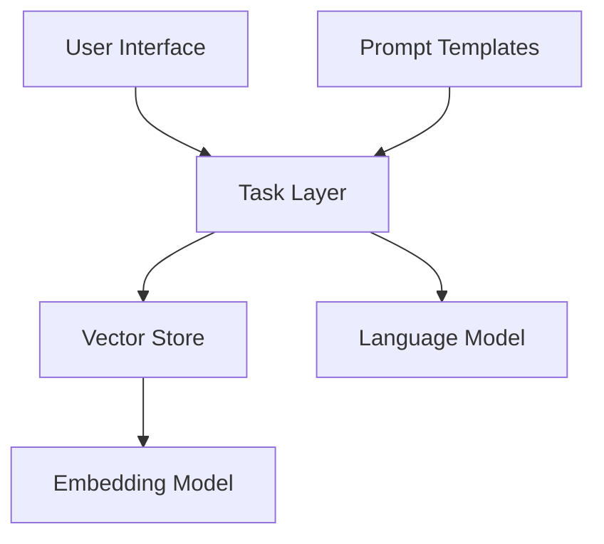

# FDA Oncology Copilot

FDA Oncology Copilot is a specialized application that uses Retrieval-Augmented Generation (RAG) to convert user-written oncology content into formal documentation that complies with FDA regulatory standards.

## Architecture and Technology Stack

### Technology Stack
- **Frontend**: Streamlit (Web interface), Office.js (Word add-in)
- **Backend**: FastAPI, Python
- **AI Components**: OpenAI API (GPT-4, Embeddings)
- **Vector Storage**: FAISS
- **Document Processing**: PyPDF2, python-docx, pandas, etc.

### Modular Architecture



### Technical Highlights
- Retrieval-Augmented Generation (RAG) ensures outputs align with authentic FDA documentation
- Not merely a summarization tool, but a converter that reformats content to meet FDA regulatory requirements
- Automatic metadata extraction and filtering capabilities
- Standardization of medical terminology according to FDA conventions
- Multi-modal interfaces (Web and Word add-in)
- Extensible modular design
- Validation of essential oncology terms in generated content

## Scalability and Future Integrations

### Current Scalability
- Modular architecture allows easy addition of new task types
- Support for multiple document formats
- Automatic data source discovery mechanism

### Data Expansion Potential
- **Current Limitation**: The RAG implementation currently uses a limited reference dataset
- **Enterprise Integration**: The system is designed to seamlessly integrate company internal document repositories, significantly enhancing conversion quality and specificity
- **Professional Resource Extension**: Additional professional medical literature, FDA historical approval documents, and industry best practice guidelines can be incorporated
- **Continuous Learning**: As more documents are added, the system's conversion capabilities will continuously improve, more accurately capturing FDA style and requirements

### Potential Future Integrations
- Support for additional language models (e.g., Anthropic Claude, Llama)
- Integration with more specialized medical databases and regulatory document repositories
- Support for additional document types
- Expansion to other regulatory document domains (e.g., EMA, NMPA)
- Addition of collaboration features and version control
- **Enterprise Knowledge Base Connectors**: Development of dedicated connectors to securely access and leverage enterprise internal knowledge bases
- **Automatic Update Mechanism**: Automatic updates to the reference database as new FDA guidelines are published

## Complete Usage Guide

### Environment Setup
1. Clone the repository:
   ```bash
   git clone https://github.com/yourusername/FDA-Doc-Copilot.git
   cd FDA-Doc-Copilot
   ```

2. Install dependencies:
   ```bash
   pip install -r requirements.txt
   ```

3. Configure environment variables:
   ```bash
   cp .env.template .env
   # Edit the .env file to add your OpenAI API key
   ```

### Data Loading
1. Create a data source directory:
   ```bash
   mkdir -p data/sources/your_source_name
   ```

2. Add document files:
   ```bash
   cp your_documents.pdf data/sources/your_source_name/
   ```

3. Build indices:
   ```bash
   python setup.py
   ```

### Running the Web Interface
```bash
python run.py
# Or use the shortcut script
./run_app.sh
```

### Deploying the Word Add-in
1. Start the add-in backend:
   ```bash
   python word_addin/run_server.py
   # Or use the shortcut script
   ./word_addin/run_word_addin.sh  # For macOS/Linux
   word_addin\run_word_addin.bat   # For Windows
   ```

2. Install the add-in in Word:
   - Open Microsoft Word
   - Go to "Insert" > "Get Add-ins" > "Manage My Add-ins" > "Upload My Add-in"
   - Select the `word_addin/manifest.xml` file
   - Click "Install"

3. Using the add-in:
   - Select text in your Word document
   - Open the FDA Oncology Copilot add-in from the Insert tab
   - Select data source and filters
   - Click "Convert to FDA-Compliant Format"
   - Review the converted content and references
   - Click "Insert into Document" to add it to your document

### Supported File Types
- Text formats: `.txt`
- Office document formats: `.pdf`, `.docx`, `.doc`
- Spreadsheet formats: `.csv`, `.tsv`, `.xlsx`, `.xls`
- Web formats: `.html`, `.htm`, `.xml`, `.json`
- Markdown: `.md`, `.markdown`
